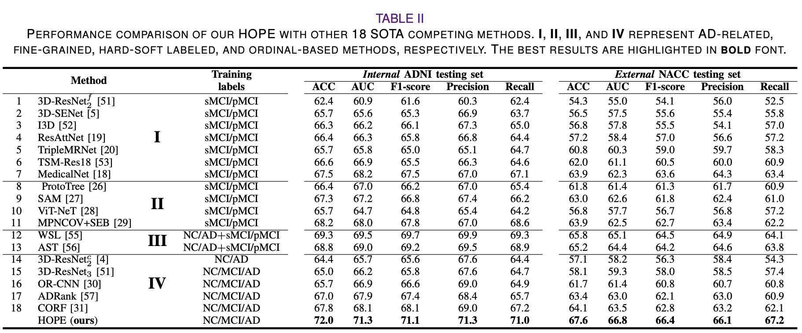

# HOPE-for-mild-cognitive-impairment

**[JBHI 2024]** This is a code implementation of the **hybrid-granularity ordinal learning** proposed in the manuscript "**HOPE:
Hybrid-granularity Ordinal Prototype Learning for Progression Prediction of Mild Cognitive Impairment**". [[doi]](https://ieeexplore.ieee.org/document/10412338) [[arxiv]](https://arxiv.org/abs/2401.10966)

## Introduction

Existing works typically require **MCI subtype labels**—**progresive MCI** (pMCI) vs. **stable MCI** (sMCI)—determined by whether or not an MCI patient will progress to AD after a period of follow-up diagnosis. However, collecting retrospective MCI subtype data is time-consuming and resource-intensive, which leads to relatively small labeled datasets, resulting in amplified overfitting and challenges in extracting discriminative information.

## Hybrid-granularity ordinal prototype learning

Based on **the ordinal development of AD**, we take a fresh perspective on the extensive cross-sectional data collected
from subjects across all stages of AD, ranging from Normal Cognition (NC) to MCI to AD, as the ''latent'' longitudinal
data specific to the entire AD cohort; the pathological differences between sMCI and pMCI are analogical to those
between NC and AD.
Inspired by this, we propose a novel **Hybrid-granularity Ordinal PrototypE learning** (HOPE) method to predict the
progression of MCI by learning the ordinal nature of AD.

 

## Experimental results

Experimental results on the internal ADNI and external NACC datasets show that the proposed HOPE outperforms recently
published AD-related and ordinal-based state-of-the-art methods and has better generalizability.

 

Moreover, we present data visualization using GradCAM and t-SNE. Our findings indicate that our HOPE has effectively
learned **the ordinal nature of AD development**. Furthermore, we have identified specific regions of interest that are
closely associated with the progression of AD.

 

## Usage

### Install requirements

First clone the repository:

```bash
git clone https://github.com/thibault-wch/HOPE-for-mild-cognitive-impairment.git
```

And then install other requirements:

```bash
pip install -r requirements.txt
```

### Data prepration

We trained, validated and tested our HOPE using the Alzheimer's Disease Neuroimaging
Initiative ([ADNI](https://adni.loni.usc.edu/)) dataset. To
investigate the generalizability of the proposed HOPE, we externally tested our HOPE on the National Alzheimer's
Coordinating Center ([NACC](https://naccdata.org/)) dataset.

We first use Freesurfer and Flirt for preprocessing all MRI images. Furthermore,
we transform the preprocessed `.nii.gz` brain files into `.npy` format.
In addition, we reorganize and split them into the data pairs for `./utils/Dataset.py` using `pickle`, the
concrete data pair demo as shown in:

```python
{   
    '0': [
    (  # the MRI file path
        '/data/chwang/final_dataset_MRI/lineared/train/0_141_S_0810.npy',
        # the diagnosis label of the corresponding MRI subject (NC->0 AD->1 sMCI->3 pMCI->4)
        0),
          ...],
    '1': [
    (   '/data/chwang/final_dataset_MRI/lineared/train/1_137_S_0841.npy',
        1),
          ...],
    '3': [...],
    '4': [...]
}
```

### Implementation details

We implement all the methods with the **PyTorch** library and train the networks on NVIDIA V100 GPUs. All networks are
built with **3D ResNet18** as the backbone, initialized by the **Kaiming** method and trained 60 epochs using the Adam
optimizer with $\beta_1 = 0.5$ and $\beta_2 = 0.999$. We set the initial learning rate to $2\times 10^{-4}$ and then
gradually reduce it using exponential decay with a decay rate of 0.95. The batch size is set to 8.
We have organized the concrete **training and inference process** in `./scripts`.

#### For Training

```bash
cd ./scripts
sh train.sh
```

#### For Inference

```bash
cd ./scripts
sh test.sh
```

## Folder structure

```
HOPE-for-mild-cognitive-impairment
  ├─ models
  │   ├─ Resnet
  │   ├─ ranking <ranking components>
  │   └─ BasicComputing <instance-to-class, class-to-class components>
  ├─ options (different options)
  ├─ scripts (different phases' scripts)
  ├─ utils
  │   ├─ Dataset <our defined dataset>
  │   ├─ train_data <training step>
  │   ├─ test_data <testing step>
  │   └─ ...
  ├─ readme_files
  ├─README.md
  ├─requirements.txt
  ├─train
  └─test
```

## Acknowledgement

- We gratefully thank the **ADNI** and **NACC** investigators for providing access to the data.

- Our code is inspired by [Blackbox Combinatorial Solvers](https://github.com/martius-lab/blackbox-backprop)
  and [RankSim](https://github.com/BorealisAI/ranksim-imbalanced-regression).


## Citation
If you find this work useful for your research, please 🌟 our project and cite [our paper](https://arxiv.org/abs/2401.10966) :

```
@article{wang2024hope,
title = {HOPE: Hybrid-granularity Ordinal Prototype Learning for Progression Prediction of Mild Cognitive Impairment}, 
author = {Chenhui Wang and Yiming Lei and Tao Chen and Junping Zhang and Yuxin Li and Hongming Shan and others},
volume = {28},
pages = {6429--6440},
year = {2024},
journal={IEEE Journal of Biomedical and Health Informatics},
}
```

